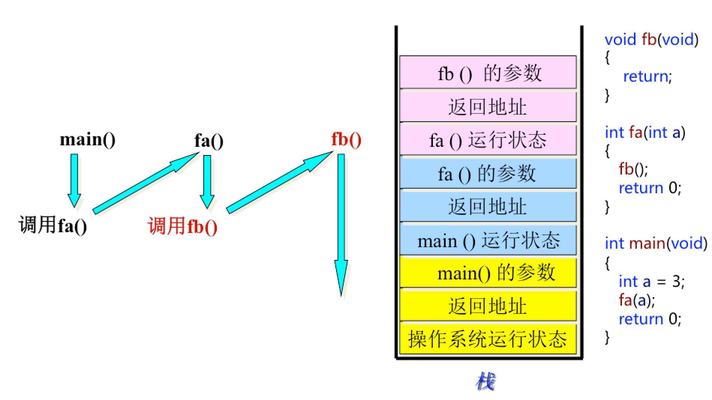
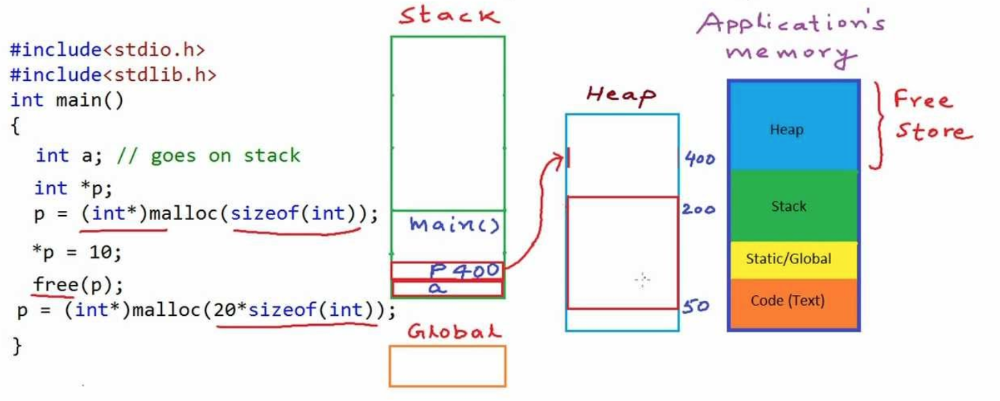
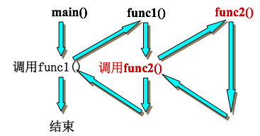
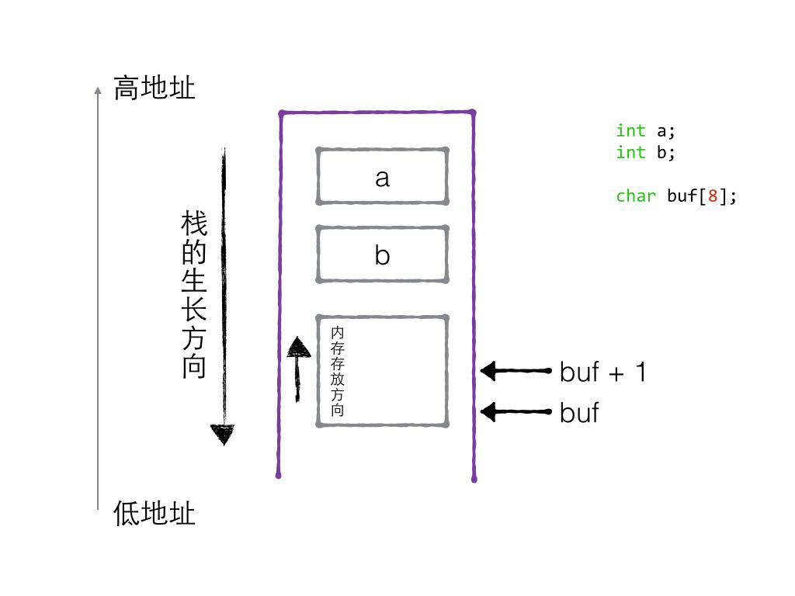

# C review note

This is a page for advanced C. 

- For basic knowledge of C, I recommend read the following blog:

	[http://www.runoob.com/cprogramming/c-tutorial.html](http://www.runoob.com/cprogramming/c-tutorial.html).

- The recommend editor is [sublimetext3](https://www.sublimetext.com/3). For use of sublime, please follow this blog [Sublime Text3 keyboard shortcuts summary](https://www.jianshu.com/p/d5441fb2ccae).

- The recommend platform is [linux ubuntu 14.04](http://releases.ubuntu.com/14.04/).

- For Mac, I recommend you install ubuntu by Parallels, you can follow this youtube video [Install Ubuntu on Mac with Parallels 10](https://www.youtube.com/watch?v=PApudf-ftkU).

- All of the code in this page could be found in [test.cpp](test.cpp). You could uncomment, then compile and run.

### [***linux terminal compile and run***]
```
new a file called test.cpp: touch  test.cpp
compile: gcc -o test test.cpp
Run: ./test
```

### C file format
```
#include "stdio.h"
#include "stdlib.h"
#include "string.h"
int main()
{
    int a = 10;
    printf("the file format: %d\n",a);
    return 0;
}
```
### [***Knowledge Note***]
- 1.1 Data Type

	- 1.1.1 Classification of data type
	
		- simple: basic type(int,float/double, char, void), user-define-type/enum
	
		- struct:array[], struct, union, class
		
		- pointer: *

	- 1.1.2 Essence of data type： [**alias of fixed space of memory**]

		- Function： **Compiler** pre-calculate space of memory to be alloced, but it has not alloc. Only when the **variable** be created will the memory be alloc.

		```
		int a = 10
		"int"  tell Compiler to alloc 4 byte memory. When compile see "a", it will alloc. 
		```

	- 1.1.3 Size of data type

		- sizeof is operator，the same as (+ — * /), it is not a function.  Size will be return after compile.


		```
		// note the %zu, should not be %d, or it will return [e1];
		printf("sizeof(a): %zu \n", sizeof(a))
		```

	- 1.1.4 Rename of datatype

	```
        // rename for struct
        typedef struct People
        {
	        char name[64];
	        int age;
        } people_t;
        // rename for unsigned int
        typedef unsigned int u32;
	```

	- 1.1.5 Void(Data Encapsulating: "nothing is impossible" type)

		- void* as left value, can point to any type of data

		```
		void* memcpy( void* dest, const void* src, size_t len );
		void* memset( void* buffer, int c, size_t num );
		void* malloc (size_t size);
		```
		
		- void* as right value, must be casted to other type of point, because ***C define only the same type of pointers can be allowed to assign with each other***.
		```
		char* p2 = (char*)malloc(sizeof(char)*20)
		```
		
		- void in function **pramater** and **return value**, means nothing.
		```
		int function(void)
		{
			return 1;
		}
		void function1(void)
		{
			return;
		}
		```
		
		- No void type variable
		
			C does not define the size of memory for void.

- 1.2 Variable
	- 1.2.1 Definition of Variable
	
		- Memory that can be read and write.
		
		- Alia of a continuous size of memory.
		
- 1.3 Model of Memory
	- Work flow

		- 1. Computer system loads C code to memory.
		
		- 2. Computer system seperates C code into 4 region.
		
			- ***stack***: **Compiler** **automatically** memory alloc and free; Store **function paramerter** and **local variable**.
			```
			char *getMem2()
			{
				char buf[64];	//  temporary local variable in stack
				strcpy(buf, "123456");
				printf("buf: %s\n", buf); // # buf: 123456
				return buf; // return the first address of memory block , not the 64 byte
			}
			```
			
			- ***heap***: **Programmer** alloc and free(dynamic memory alloc and free); If Programmer not free, **Computer System** will free it at the end of program;
			
			```
			char *getMem(int num)
			{
				char *p1 = NULL;
				p1 = (char*)malloc(sizeof(char)* num); // dynamic memory alloc in heap
				if (p1 == NULL)
				{
					return NULL;
				}
				return p1; // return head of memory block of num byte
			}
			// for test code, please check test.cpp 1.3.1
			```
			
			- ***static***: **global variable** & **static variable**; **Initialized** and **Uninitialized** are seperately put in adjacent two memory region; **Computer System** will free at the end of program.
			
			- ***const***: Store string const and other const; **Computer System** will free at the end of program.

			```
			//1.3.2 global 
			// note should use const, or it will output warning/error [e2]
			const char *getStr1()
			{
				const char *p1 = "abcdefg2";
				return p1;
			}
			const char *getStr2()
			{
				const char *p2 = "abcdefg2";
				return p2;
			}
			// for test code, please check test.cpp 1.3.2
			```
			
			- ***code***: Store binary code of function.
			
- 1.4 Model of Function Callback



- 1.5 Analyze of Varibale Transfer During Function Callback

	 

	- 1. main could alloc on **stack/heap/global**, this variable could be used by func1 & func2;
	
	- 2. Memory on **stack** alloced by func2, could **not** be used by func1 & main;
	
	- 3. Memory on **heap** alloced by func2, could be used by func1 & main;
	
	- 4. Memory on **global** alloced by func2, could be used by func1 & main;

- 1.6 Direction of stack and memory.

	- [stackflow-stack-address-grow-towards-decreasing-memory-addresses](https://stackoverflow.com/questions/4560720/why-does-the-stack-address-grow-towards-decreasing-memory-addresses)
	
	 

	```
	// 1.6 stack grow direction 
	int main(void)
	{
		int a;
		int b;
		char buf[4];
		printf("&a: %p\n", &a); // # &a: 0x7fff51f11eb8
		printf("&b: %p\n", &b); // # &b: 0x7fff51f11ebc
		printf("Address of buf : %p\n", &buf[0]); // # 0x7fff51f11ec0
		printf("Address of buf+1: %p\n", &buf[1]);// # 0x7fff51f11ec1
		return 0;
	}
	// 这里我测试的地址是 a低，b高，但a是先压栈的，b是后压栈的，如果按照栈从高地址开始的解释话，
	// 就不对了，所以我电脑（macbook虚拟机Ubuntu14）上应该是栈也从低地址开始压，所以和内存生长是一个方向了？
	```

###  [***Common Error & Solution***]
**[e1]** ``` ‘%d’ expects argument of type ‘int’, but argument 2 has type ‘long unsigned int’ ```

**[s1]** 1.1.3  %d -> %zu

[stackflow-d-expects-argument-of-type-int-but-argument-2-has-type-long-unsigned-int](https://stackoverflow.com/questions/21128092/d-expects-argument-of-type-int-but-argument-2-has-type-long-unsigned-int)

**[e2]** ```warning:  deprecated conversion from string constant to ‘char*’ ```

**[s2]** 1.3.2  char* -> const char*

[https://stackoverflow.com/questions/1524356/c-deprecated-conversion-from-string-constant-to-char](https://stackoverflow.com/questions/1524356/c-deprecated-conversion-from-string-constant-to-char)
